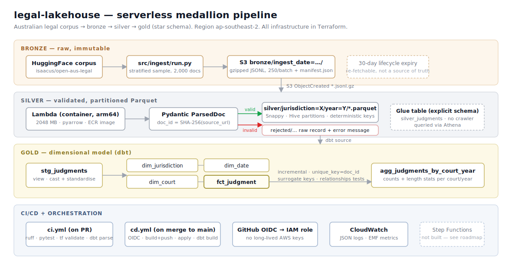

# legal-lakehouse

A serverless medallion-architecture data pipeline over the [Open Australian Legal Corpus](https://huggingface.co/datasets/isaacus/open-australian-legal-corpus). It samples ~2,000 legal documents from Hugging Face into an S3 bronze layer, validates and partitions them into silver Parquet via a containerised Lambda, and models them into a dbt star schema in gold — queryable in Athena. Every piece of infrastructure is defined in Terraform; nothing was clicked in the console.

Built to demonstrate the stack Australian data-engineering roles actually ask for: SQL, Python, AWS (S3/Glue/Lambda/Athena), dimensional modelling, dbt, medallion architecture, IaC, and CI/CD.

> **Current state:** the pipeline runs end to end — 2,000 documents through bronze → silver → gold, reconciling exactly, with 43 unit tests and a full dbt test suite passing. CI runs on every PR; CD deploys on merge to `main` via GitHub OIDC with no long-lived AWS credentials.



---

## Quickstart

Requires Python 3.11+, Terraform ≥1.10, Docker, and AWS credentials for `ap-southeast-2`.

```bash
# 1. Install
python -m venv .venv && .venv/Scripts/activate      # Windows; use bin/activate on macOS/Linux
pip install -r requirements.txt

# 2. Bootstrap remote state (once, ever)
cd infra/bootstrap && terraform init && terraform apply

# 3. Build and push the parser image
aws ecr get-login-password --region ap-southeast-2 \
  | docker login --username AWS --password-stdin <account>.dkr.ecr.ap-southeast-2.amazonaws.com

SHA=$(git rev-parse --short HEAD)
docker buildx build --platform linux/arm64 -f src/parser/Dockerfile \
  -t <account>.dkr.ecr.ap-southeast-2.amazonaws.com/legal-lakehouse-parser:$SHA \
  --provenance=false --sbom=false --push .

# 4. Deploy everything else
cd ../main && terraform init && terraform apply -var="parser_image_tag=$SHA"

# 5. Ingest → bronze (the Lambda fires automatically on upload)
python -m src.ingest.run --bucket <data-bucket>

# 6. Register partitions, then build gold
#    (Athena) MSCK REPAIR TABLE legal_lakehouse.silver_judgments;
cd dbt && dbt deps && dbt build
```

Tests run with no AWS access at all:

```bash
pytest -v      # 43 tests
ruff check src tests
```

---

## Layer contract

| | **Bronze** | **Silver** | **Gold** |
|---|---|---|---|
| **Format** | Gzipped JSONL, 250 records/file | Parquet, Snappy | Parquet via Athena CTAS |
| **Partitioning** | `ingest_date=YYYY-MM-DD` | `jurisdiction=X/year=Y` (Hive) | `jurisdiction_code/year_partition` on the fact |
| **Mutability** | Immutable, append-only | Overwritten by deterministic key | Incremental merge on `doc_id` |
| **Schema enforcement** | None — raw as pulled | Pydantic `ParsedDoc`; failures → `rejected/` | dbt tests: `not_null`, `unique`, `accepted_values`, `relationships` |
| **Retention** | 30-day lifecycle expiry | Indefinite | Indefinite |
| **Written by** | `src/ingest/run.py` | Parser Lambda | dbt |
| **Consumed by** | The parser Lambda only | dbt, Athena | Analysts, BI |

Bronze expires after 30 days on purpose: it's a re-fetchable cache of a public dataset, not a system of record. Silver can always be rebuilt from a fresh pull.

---

## Data model

Star schema, grain stated explicitly on every model.

- **`fct_judgment`** — one row per legal document. FKs to all three dimensions, degenerate dimensions (`doc_id`, `citation`, `source_url`), measures (`text_length`, `word_count`). Materialised incrementally on `unique_key='doc_id'`.
- **`dim_jurisdiction`** — one row per jurisdiction. Federal/state/territory split.
- **`dim_court`** — one row per court, with `court_level` (appellate / first_instance / tribunal) inferred from name patterns.
- **`dim_date`** — daily spine 1900–2030 via `dbt_utils.date_spine`, with decade/quarter/weekend attributes.
- **`agg_judgments_by_court_year`** — mart: counts and length statistics per court and year.

All dimensions use **surrogate keys** (`dbt_utils.generate_surrogate_key`), not natural keys. If the source recodes a jurisdiction, every fact row referencing it would break under natural keys; a hash insulates the warehouse from source-system churn and keeps every FK column a uniform type.

Two dimensions carry **explicit unknown members**: `dim_court` has a "Not applicable" row (legislation has no court) and `dim_date` has an "unknown" row (~a fifth of the corpus has no parseable date). Facts point at those rather than carrying null FKs — which is what lets the `relationships` tests be strict rather than tolerating nulls.

---

## Design decisions and tradeoffs

**Lambda over Glue/PySpark.**
*Alternative:* a Glue Spark job.
*Why:* at 2,000 documents (~20 MB compressed), Spark is pure overhead — cluster startup alone exceeds the entire Lambda runtime. I'd switch when any of these hit: a single batch exceeding Lambda's 10 GB memory ceiling, per-batch runtime approaching the 15-minute timeout, or any transformation requiring a shuffle (joins/aggregations across partitions), which Lambda can't do without pulling everything into one invocation. Roughly: low hundreds of thousands of documents, or the first genuine cross-partition join.

**Athena over Redshift.**
*Alternative:* a Redshift cluster or Serverless workgroup.
*Why:* the query pattern is infrequent and analytical over data already in S3. Athena has no idle cost; Redshift Serverless bills a minimum RPU-hour and provisioned Redshift bills continuously. At this volume Athena costs cents. Redshift becomes right when queries are frequent enough that per-query scanning costs exceed a cluster's fixed cost, or when concurrency/joins need a real query planner over sorted, distributed storage.

**One bucket with prefixes over three buckets.**
*Alternative:* separate bronze/silver/gold buckets.
*Why:* one bucket keeps IAM policies short and readable — a single ARN with prefix conditions instead of three sets of grants. Prefix-scoped lifecycle rules give the independent retention that separate buckets would. Separate buckets earn their complexity when layers need genuinely different security boundaries (different accounts, different encryption keys, different compliance regimes) — not here.

**Incremental over full refresh on the fact table.**
*Alternative:* `materialized='table'`, rebuilt every run.
*Why:* full refresh would work fine at 2,000 rows and is simpler. But the incremental filter is the piece that has to be *correct* before scale makes it matter, and `unique_key='doc_id'` over a deterministic SHA-256 means reprocessing merges rather than duplicating — the warehouse inherits the same idempotency the storage layer already has. Building it now costs nothing; retrofitting it after the fact table matters is a migration.

**Deterministic `doc_id` = SHA-256 of source URL.**
*Alternative:* a UUID or row-number surrogate assigned at parse time.
*Why:* this is the single decision that makes the whole pipeline idempotent. Same source document → same ID → same S3 key → S3 overwrites instead of appending. Re-running the pipeline on the same bronze data is a no-op rather than a duplication event, and backfilling a partition is safe by construction. A random ID would make every re-run a data-quality incident.

**Container image Lambda over a zip.**
*Alternative:* a zip deployment package with a pyarrow layer.
*Why:* pyarrow alone exceeds Lambda's 250 MB unzipped limit. The container path also picks up Docker as a demonstrable skill and makes the runtime reproducible locally. Cost: cold starts are slower, and the ECR push is a genuine extra failure surface (see "Known issues").

**No Glue crawler.**
*Alternative:* scheduled crawler to infer the silver schema.
*Why:* crawlers cost money per run and drift — they'll happily infer a changed type and silently break downstream models. The Glue table is declared explicitly in Terraform, so schema changes go through code review like everything else.

**GitHub OIDC over stored AWS keys.**
*Alternative:* `AWS_ACCESS_KEY_ID` / `AWS_SECRET_ACCESS_KEY` as repo secrets.
*Why:* no long-lived credentials exist to leak or rotate. The trust policy is scoped to `repo:<owner>/legal-lakehouse:ref:refs/heads/main` — a `:*` wildcard there would let a PR from any fork assume the deploy role, which is the most common way this gets misconfigured.
*Status:* the role assumption currently fails — see "Known issues" below. Deployment is manual in the meantime. The scoped-not-wildcard decision stands regardless; loosening it was tried as a diagnostic and reverted without being applied.

**No AWS credentials in PR CI.**
*Alternative:* `terraform plan` on PRs, posted as a comment.
*Why:* that's a genuinely nice touch, and I'd add it on a private repo. On a public one it means fork PRs can reach AWS, and the blast radius of a mistake in that trust policy is the whole account. `terraform validate -backend=false` and `dbt parse` catch the same class of error with zero credentials.

---

## Data quality

**Reconciliation.** `bronze == silver + rejected`, enforced two ways:
- `src/ops/reconcile.py` — the storage-side check (bronze manifest count vs. Athena silver count vs. rejected JSONL line count). `rejected/` has no Glue table over it, so this half can't be expressed in SQL.
- `dbt/tests/assert_fact_matches_silver_source.sql` — the warehouse-side check, running in CI on every `dbt build`.

**Result on the real ingest: 2,000 bronze → 2,000 silver → 0 rejected.**

Zero rejects is an honest result, not a passing grade: the Open Australian Legal Corpus is already curated and normalised by its publisher, so every record satisfies the `ParsedDoc` contract. That left the `rejected/` path completely untested against real infrastructure — an error path that has never run is not a proven error path.

So `src/ops/seed_reject_fixture.py` writes a deliberately malformed batch under its own `ingest_date` (so it never contaminates real counts), with one record per validator:

| Fixture record | Expected | Validator |
|---|---|---|
| valid control | parsed | — |
| empty text | **rejected** | `text_must_not_be_empty` |
| missing jurisdiction | **rejected** | `jurisdiction_must_be_present` |
| missing url | **rejected** | `source_url_must_be_present` |
| unknown doc_type | **rejected** | `doc_type_must_be_known` |
| malformed date | parsed, `year='unknown'` | by design — never a crash |

Result: 6 → 2 silver + 4 rejected. The valid control landing in silver alongside four rejects is the "one bad record must not kill the batch" guarantee, demonstrated rather than asserted.

**Known data quality characteristics of the source:**
- Roughly a fifth of documents have no parseable date and land in the `year=unknown` partition. This is a property of the corpus (much legislation carries no single date), not a parsing failure.
- `court` does not exist in the source. It's derived from the neutral citation (`[2013] NSWSC 1668` → "Supreme Court of New South Wales") via a lookup table covering the common Australian courts and tribunals. The table is **not exhaustive** — unmapped abbreviations fall through as the raw abbreviation rather than being dropped, so `dim_court` will contain some bare codes.
- The corpus is heavily skewed toward NSW caselaw (~half of all documents). The ingest deliberately stratifies by jurisdiction with a per-year cap to avoid a single-jurisdiction sample that would make the partitioning look pointless.

**Other checks:** dbt source freshness (`warn_after: 24h`, `error_after: 72h`), `not_null`/`unique` on `doc_id` at the staging layer so failures surface before the fact table, `relationships` tests on every FK, `accepted_values` on jurisdiction/doc_type/court_level, and a domain-specific singular test asserting no document is dated in the future.

---

## Observability

Structured JSON logging throughout the parser — CloudWatch Logs Insights queries JSON natively, plain strings it cannot:

```
fields @timestamp, source_key, parsed_count, rejected_count, duration_ms
| filter event = "batch_completed"
| sort @timestamp desc
```

Custom metrics via **EMF** (Embedded Metric Format) — writing a specially-shaped JSON object to stdout, so CloudWatch extracts `RecordsParsed`, `RecordsRejected` and `ParseDurationMs` with no `PutMetricData` call, no added latency, and no extra IAM permission. `source_key` is deliberately a *property*, not a dimension: one metric stream per S3 object would explode cardinality and cost.

---

## Operations

**Backfill a single partition:**
```bash
python -m src.ops.backfill --jurisdiction new_south_wales --year 2019 --dry-run
python -m src.ops.backfill --jurisdiction new_south_wales --year 2019
```

Safe to run repeatedly — deterministic `doc_id`s mean identical output keys, so S3 overwrites rather than appending. Run it twice and the Athena row count is unchanged.

**Prove idempotency end-to-end:**
```bash
python -m src.ops.reinvoke_parser --bucket <data-bucket> --ingest-date 2026-07-20
```
Run twice; `parsed` and `distinct silver files written` are identical both times.

**Tear down:**
```bash
cd infra/main && terraform destroy
# infra/bootstrap has prevent_destroy on the state bucket — remove it deliberately if you mean it
```

---

## Cost

> **TODO — fill from Cost Explorer once the account has 24h of data.**
> Console → Billing → Cost Explorer → filter to tag `Project=legal-lakehouse`.
> Report actual spend across the build, plus a projected monthly figure at 10× volume.
> Every resource in this project is tagged, so the filter gives a clean number.

Cost design notes, pending real figures:
- Lambda memory is set to 2048 MB, which is *cheaper* than 1024 MB here, not more expensive: billing is per GB-second and CPU scales with memory, so a job that finishes 3× faster at 2× memory wins.
- arm64 over x86_64 for a further ~20% per-invocation saving.
- Bronze expires at 30 days; Athena query results at 7.
- A $10/month AWS Budget with alerts at 50% and 80% was created before any infrastructure.

---

## Known issues and gotchas hit while building

Documented because each cost real time and none is obvious from the docs.

**GitHub's OIDC `sub` claim contains immutable numeric IDs that no documentation shows.** This was the single most expensive bug in the project — hours, not minutes — so it's documented in full.

*Symptom:* `cd.yml` fails at the credentials step with `Could not assume role with OIDC: Not authorized to perform sts:AssumeRoleWithWebIdentity`, while every value on the AWS side verifies as correct.

*Cause:* the `sub` claim GitHub actually issues is

```
repo:Jasminephannd@57733436/legal-lakehouse@1306134894:ref:refs/heads/main
```

not the classic, universally-documented shape

```
repo:Jasminephannd/legal-lakehouse:ref:refs/heads/main
```

GitHub appends **immutable numeric IDs** to both the owner and the repository name. The trust policy, written from AWS's and GitHub's own documentation, never matched.

*Why it's so hard to spot:* the IDs are invisible everywhere you'd naturally look. `github.repository` in the workflow context renders as the plain `owner/repo`. The IAM trust policy, OIDC provider URL, audience, `ClientIDList`, and role ARN all verify as correct — because they are. CloudTrail logs nothing, because the request is rejected at token validation. The only way to see it is to **decode the issued JWT**, which is why `cd.yml` now has a permanent step that does exactly that.

*Fix:* list both `sub` forms in the trust policy (see `infra/main/oidc.tf`). The ID form is the stronger of the two — numeric IDs are immutable, so deleting and recreating a repo under the same name yields a different ID and won't match, closing a name-reuse hole the classic form leaves open.

*A false lead worth recording:* the deploy role was originally named `legal-lakehouse-github-deploy`, and there is a real open bug where a role name containing `github` breaks this action ([#1093](https://github.com/aws-actions/configure-aws-credentials/issues/1093), [#953](https://github.com/aws-actions/configure-aws-credentials/issues/953)). That looked like a perfect match for the symptoms and it was **not** the cause here. The role is still named `legal-lakehouse-ci-deploy` to avoid the known issue, but renaming it fixed nothing.

*The transferable lesson:* when every input verifies as correct, stop re-verifying inputs and go read what's actually on the wire.

| Checked | Result |
|---|---|
| Secret present in the workflow | `AWS_DEPLOY_ROLE_ARN` length 60 — correct ARN, no whitespace. Confirmed by a preflight step that prints length, never the value |
| Repository vs. Environment secret | Repository secret; the job declares no `environment:`, so an Environment secret would never resolve |
| `id-token: write` permission | Present at workflow level. Its absence produces a *different* error, and the log shows a token being issued |
| OIDC provider URL | `token.actions.githubusercontent.com` — exact |
| Provider `ClientIDList` | `["sts.amazonaws.com"]` — matches the audience the action requests |
| Trust policy `aud` condition | `StringEquals sts.amazonaws.com` — matches |
| Trust policy `sub` condition | `repo:<owner>/legal-lakehouse:ref:refs/heads/main` |
| Rendered workflow context | `github.repository` = `<owner>/legal-lakehouse` — appeared to match exactly |
| CA thumbprint | Replaced a placeholder with GitHub's two real intermediate thumbprints. No change (consistent with AWS's documented behaviour of ignoring it since July 2023) |
| CloudTrail `AssumeRoleWithWebIdentity` | No events in `us-east-1` or `ap-southeast-2` — the request is rejected at token validation, before account-level policy evaluation |
| Role name containing `github` | Renamed to `legal-lakehouse-ci-deploy`. A real known issue, but **not** the cause here |
| **Decoded JWT `sub` claim** | **`repo:<owner>@57733436/legal-lakehouse@1306134894:ref:refs/heads/main` — immutable IDs appended. This was the bug.** |

A wildcard trust policy (`repo:owner/repo:*`) was written as a diagnostic and reverted **without ever being applied** — loosening it would have masked the real cause and shipped the exact misconfiguration this project is meant to demonstrate avoiding.

**Buildx + Lambda: `--provenance=false --sbom=false` is mandatory.** Buildx's default `--push` attaches provenance/SBOM attestations, which wrap the image in an OCI *image index*. Lambda only accepts a plain single-architecture manifest and fails with `InvalidParameterValueException: The image manifest, config or layer media type ... is not supported`. Worse, the push may report success — `aws ecr describe-images` showed the tag `ACTIVE` — while producing an artifact Lambda can't consume. Check `imageManifestMediaType` is `image.manifest`, not `image.index`.

**Terraform still requires an OIDC thumbprint.** AWS has verified GitHub's OIDC endpoint against its trusted root CAs since July 2023, so the thumbprint is ignored in practice — but `aws_iam_openid_connect_provider` still validates that `thumbprint_list` contains an exactly-40-character string.

**Partition keys must not be written into the Parquet file.** `jurisdiction` and `year` live in the S3 key path. Writing them into the file too duplicates data and risks a schema mismatch against a Glue table that declares them as `partition_keys`. The writer excludes them explicitly (`PARTITION_KEY_FIELDS` in `src/parser/handler.py`).

**The dataset moved and the split isn't `train`.** `umarbutler/open-australian-legal-corpus` now redirects to `isaacus/…`, and the dataset defines only a `corpus` split — `split="train"` fails outright.

**`dbt-athena-community` is deprecated** in favour of `dbt-athena`, which dbt Labs took over maintaining in late 2024. The community package is now a compatibility wrapper; installing both risks a conflict.

---

## What I'd do next

Scoped out deliberately, in the order I'd add them:

1. **Resolve the OIDC role assumption** (see Known issues) so CD actually deploys. Next avenues: enable a CloudTrail *trail* rather than relying on default Event history, decode the raw OIDC token's claims in-workflow to compare against the trust policy byte-for-byte rather than trusting the rendered `github.*` context, and check whether a custom OIDC subject-claim template is set on the repository.
2. **Step Functions orchestration** — `Ingest → Map(parse) → dbt build → Notify`, with retries (`BackoffRate: 2.0`), a `Catch` routing to SNS, an SQS DLQ on the parser, and `MaxConcurrency` capped at ~5. Today ingest and parse are invoked manually; this is the clearest gap between "portfolio pipeline" and "production pipeline."
3. **CloudWatch dashboard and alarms in Terraform** — invocations/errors/duration p50 and p99, the EMF custom metrics, and S3 object counts per layer. Two alarms (parser error rate >5%, Step Functions failure) to SNS. The metrics are already being emitted; only the dashboard is missing.
4. **`dbt-expectations`** for distributional checks — `text_length` within reasonable bounds, jurisdiction distribution not shifting sharply between runs.
5. **Row-count anomaly detection** — fail if an ingest is under 50% of the trailing average. Crude, but it's the check that catches silently truncated upstream loads.
6. **A runbook** (`docs/runbook.md`) — what to do when the parser alarm fires, how to replay the DLQ, how to roll back a bad dbt deploy.
7. **Expand the court lookup table**, or replace it with a proper reference dataset. Deriving `court` from citation abbreviations works for the common cases and degrades gracefully, but it's the weakest link in `dim_court`.
8. **Move to Glue/Spark** if volume grows past the thresholds in the decisions section above — the parser is a pure function, so the transformation logic ports directly.

---

## Repository layout

```
infra/bootstrap/   Terraform state bucket (local state, applied once)
infra/main/        All other infrastructure (remote state, S3 native locking)
src/ingest/        HF corpus → bronze. sample.py is pure and unit-tested.
src/parser/        bronze → silver. parser.py is pure; handler.py adds S3 I/O.
src/ops/           reconcile, backfill, idempotency proof, reject fixture
dbt/               staging → dimensions → fact → mart
tests/             40 tests, no AWS credentials required
docs/              architecture diagram
```

The recurring pattern: **pure logic separated from I/O**. `sample.py`, `parser.py`, `observability.py` and the key-naming functions in `handler.py` contain no network or AWS calls, which is why the full suite runs in ~2 seconds with no credentials and no mocking — and why two real bugs (a stratification cap that silently under-filled samples, and partition keys leaking into Parquet) were caught by failing tests rather than in production.
